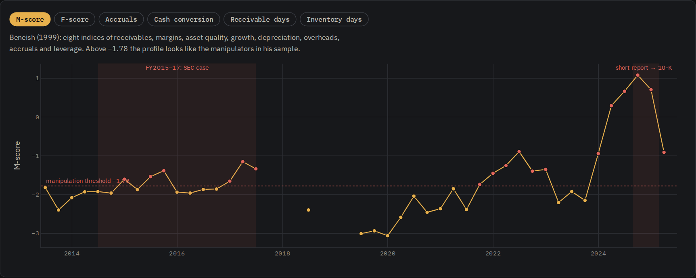
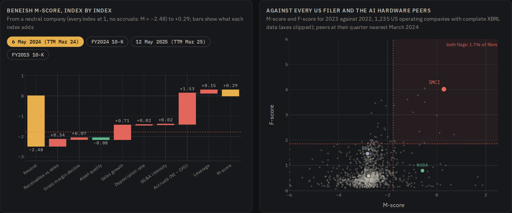
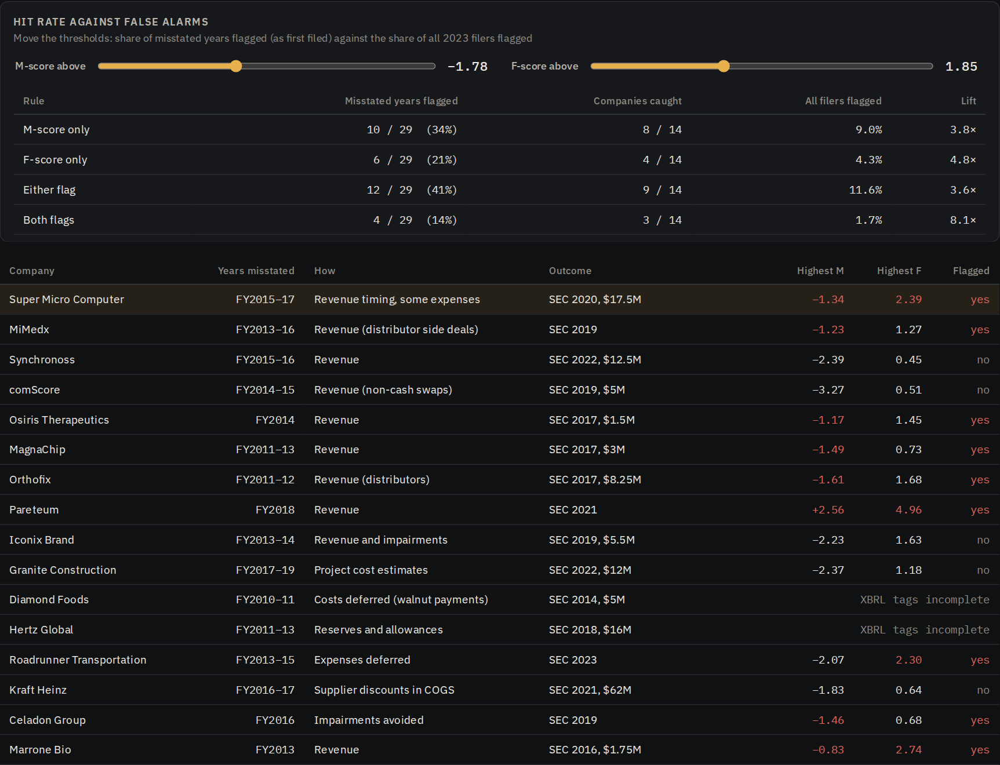

# Super Micro Forensic Analysis: Earnings Quality and Accounting Red Flags

**Author:** Alessandro Radice · M.Sc. Economics and Business Law (Finance), Università Cattolica del Sacro Cuore, Milan

**Live page:** [alessandroradice.github.io/Super-micro-forensic-analysis](https://alessandroradice.github.io/Super-micro-forensic-analysis/)

**30 June 2025. Super Micro Computer has filed its delayed fiscal 2024 10-K: a clean opinion on the numbers, an adverse one on internal controls, no restatement. A year earlier it was one of the market's best performers; since then it has faced a short report, a Justice Department probe and the resignation of its auditor. A credit committee asks: do the financial statements themselves carry red flags, would a systematic screen have seen the trouble before the market did, and how far can such a screen be trusted?**

A forensic due-diligence case study on real SEC filings. It rebuilds **every Super Micro quarter since 2013 exactly as first filed** (SEC XBRL facts with their filing dates, so later restatements do not leak backwards), runs the **Beneish M-score** and the **Dechow F-score** with cash-conversion metrics, compares Super Micro with Nvidia, Dell, HPE and **1,235 US operating companies**, back-tests the screen on **14 companies the SEC later charged**, and measures the market reaction. The main output is an **interactive web page**; it comes with a Colab notebook, an **Excel forensic screen with live formulas**, an investment memo and a presentation deck.



---

## Objective

Manipulated earnings leave traces: sales run ahead of cash, receivables and inventory pile up, profit stops turning into operating cash flow. This project:

1. **Rebuilds the numbers point in time.** Each quarter uses only the filings made by its own report date, so the screen sees what an analyst could have read then.
2. **Reads Super Micro through two standard screens** for twelve years, including fiscal 2015 to 2017, the years the SEC later found misstated.
3. **Tests the screen** against every US filer (false alarms) and against SEC enforcement cases (hits), then states what a lender should do in June 2025.

---

## Key results

**What the screen saw on 6 May 2024**, the day the third-quarter 10-Q was filed, 113 days before the short report (trailing twelve months to 31 March 2024)

| | Super Micro | Nvidia | Dell | HPE |
|---|---|---|---|---|
| Sales growth | 80% | 208% | −8% | −4% |
| Operating cash flow / net income | -1.77× | 0.95× | 2.21× | 3.06× |
| Accruals / assets | 48.2% | 3.4% | −5.3% | −6.5% |
| **M-score** (threshold −1.78) | **+0.29** | −0.58 | −2.82 | −2.78 |
| **F-score** (substantial above 1.85) | **4.01** | 0.79 | 1.46 | 0.58 |

- **The numbers carried the warning.** $1.05bn of net income against **−$1.85bn of operating cash flow**; receivables up 146% on sales up 80%; inventory at 152 days of cost of sales. Super Micro sat above 97.6% of US filers on M and 99.6% on F; only 1.7% carried both flags.
- **Accruals, not growth, set it apart.** Growth alone moves the M-score (Nvidia also crosses −1.78), but accruals added +1.53 to Super Micro's.
- **The same pattern as the SEC case.** The screen flagged 6 of 12 quarters in fiscal 2015 to 2017, as first filed. It also flagged fiscal 2022, when nothing was later restated.
- **The market came later.** From the 10-Q to the low of 14 November 2024 the shares fell **78%** while the Nasdaq-100 rose 16%; the day EY resigned they fell 32.7% (−30.4% abnormal).

**Back-test on 14 SEC enforcement cases**, each misstated year as first filed, against 1,235 US filers in 2023

| Rule | Misstated years flagged | Companies caught | All filers flagged | Lift |
|---|---|---|---|---|
| M-score above −1.78 | 10 / 29 | 8 / 14 | 9.0% | 3.8× |
| F-score above 1.85 | 6 / 29 | 4 / 14 | 4.3% | 4.8× |
| Either flag | 12 / 29 | 9 / 14 | 11.6% | 3.6× |
| Both flags | 4 / 29 | 3 / 14 | 1.7% | 8.1× |

The screen catches revenue and working-capital schemes; it misses Synchronoss, comScore, Iconix Brand, Granite Construction, Kraft Heinz, whose swaps, estimates and cost timing barely move receivables or cash. It flags about one filer in nine, so most companies it flags are not manipulating.

**June 2025.** The audited fiscal 2024 accounts are the worst reading in the series (M +0.66, F 6.1, operating cash flow −$2.49bn); the 10-Q of 12 May 2025 shows cash flow back above zero ($0.15bn), inventory days down to 74 and the F-score at 1.9. **Recommendation: lend only with cash-based protection** (covenants on operating cash flow and inventory, an audited borrowing base, reporting on related-party purchases, triggers on auditor changes or late filings) and use the screen as a trigger for questions, not a verdict.



---

## What it does

| Step | Module | What it produces |
|---|---|---|
| 1 | **Data** | SEC XBRL company facts with filing dates, SEC frames for all US filers, Super Micro's filing history, daily prices (DoltHub) |
| 2 | **Point-in-time panel** | Trailing-twelve-month financials at any quarter end, using only filings made by a given date |
| 3 | **The screens** | Beneish M-score (8 indices), Dechow F-score (model 1, RSST accruals), accruals, cash conversion, receivable and inventory days |
| 4 | **Super Micro, 2013 to 2025** | Scores at every quarter end, as first filed |
| 5 | **6 May 2024** | Index-by-index decomposition; Nvidia, Dell and HPE at the same time |
| 6 | **Every US filer** | 1,235 companies in 2023: percentiles and false-alarm rates |
| 7 | **Back-test** | 14 SEC cases, hit rate against false alarms, by type of scheme |
| 8 | **The market** | Split-adjusted prices, beta to the Nasdaq-100, abnormal returns on event days |
| 9 | **June 2025** | Latest filings, late-filing notices and auditor changes from the filing history |
| 10 | **Export** | The interactive page `Super_Micro_Forensic_Analysis.html` |
| 11 | **Excel** | The forensic screen `Super_Micro_Forensic_Screen.xlsx`, with live formulas |

### The interactive page

`Super_Micro_Forensic_Analysis.html` opens in any browser:

- **Twelve years**: M-score, F-score, accruals, cash conversion, receivable and inventory days at every quarter, with the SEC case and the 2024 episode shaded.
- **6 May 2024**: an M-score waterfall for any reading (before the short report, fiscal 2024, May 2025, fiscal 2015) and Super Micro against 1,235 US filers and its peers.
- **The market**: share price with the events, day and abnormal returns.
- **Back-test**: sliders for the two thresholds that recompute hit rates, companies caught, false alarms and lift.



### The Excel forensic screen (9 tabs)
`Cover` · `Inputs` · `Beneish` · `Dechow` · `Timeline` · `Validation` · `Universe` · `Market` · `Checks`

- **Inputs**: choose any quarter (yellow cell) and the two thresholds; the financials for that quarter, the year before and two years before are pulled by formula.
- **Beneish** and **Dechow**: every index and variable as a formula, with each one's contribution to the score.
- **Timeline** and **Validation**: the raw financials as first filed ($ millions, blue) and every score recomputed by formula; hit rates at the thresholds on Inputs.
- **Universe** and **Market**: false-alarm rates and percentiles; beta by `SLOPE` and abnormal returns on the event days.
- **Checks**: 16 reconciliations with the Python engine. Banker colour code: **blue** = input, **black** = formula, **green** = link.

---

## Methodology

- **Point in time.** Every fact from the SEC company-facts API carries the date it was filed. For a quarter, the panel keeps the latest value filed on or before that quarter's 10-Q or 10-K date, so original figures are used even where later filings restated them.
- **Trailing twelve months.** Flows = latest fiscal year + year-to-date − prior year-to-date (52/53-week calendars handled); balances at the quarter end. Each score compares a TTM with the TTM a year earlier.
- **Beneish M-score (1999).** `M = −4.84 + 0.920·DSRI + 0.528·GMI + 0.404·AQI + 0.892·SGI + 0.115·DEPI − 0.172·SGAI + 4.679·TATA − 0.327·LVGI`. A missing index is set to its neutral value.
- **Dechow F-score (2011, model 1).** `logit = −7.893 + 0.790·RSST accruals + 2.518·ΔReceivables + 1.191·ΔInventory + 1.979·Soft assets + 0.171·ΔCash sales − 0.932·ΔROA + 1.029·Issuance`; F = probability / 0.37%.
- **Universe.** SEC frames for calendar 2021 to 2023; companies with sales and assets above $50M and complete data.
- **Back-test.** 16 SEC enforcement or restatement cases for inflated earnings; Hertz and Diamond Foods lack standard tags and are excluded.
- **Market.** Abnormal return = return − β × QQQ return, β estimated from July 2023 to July 2024 (3.00).

## Limitations

- Both models were estimated on older samples; thresholds are conventions, not calibrated probabilities for 2024.
- XBRL tags vary by company and year; missing tags set an index to neutral and the reading is marked.
- The false-alarm rate comes from 2023 while the SEC cases span 2011 to 2019, so the lifts are indicative; undetected manipulators sit in the "clean" universe.
- Fast growth raises the M-score mechanically. The screen reads only the financial statements: related parties, export controls and governance need document review.
- Nothing here states or implies that Super Micro's fiscal 2024 or later accounts are misstated; no regulator had reached a conclusion by 30 June 2025.

This project is for educational purposes and is not investment advice.

---

## What you need

| Requirement | Details |
|---|---|
| **Environment** | A Google account to run the notebook in [Google Colab](https://colab.research.google.com), free tier is enough. It also runs in any local Jupyter with Python 3.10+. |
| **Python libraries** | `pandas`, `numpy`, `matplotlib`, `requests`, `openpyxl`. The first cell installs what is missing. |
| **Data** | Bundled in `data/`. If the folder is missing, the notebook downloads everything from the SEC and DoltHub (about 10 minutes; set `SEC_USER_AGENT` to your name and email, as the SEC requires). |
| **To open the outputs** | Any modern browser for the page (it loads Plotly and the fonts from public CDNs); Microsoft Excel or Google Sheets; any PDF reader. |
| **Background knowledge** | Financial statement analysis, accruals and cash flow, basic statistics. |

## How to run it

1. Open `Super_Micro_Forensic_Analysis.ipynb` in Google Colab and upload the `data/` folder next to it (otherwise the data are downloaded).
2. `Runtime → Run all` (under a minute with the bundled data).
3. Change `STUDY_DATE`, `TICKERS` or the thresholds to screen another company or another date.
4. The last two cells write `Super_Micro_Forensic_Analysis.html` and `Super_Micro_Forensic_Screen.xlsx` and, in Colab, download them.
5. In Excel, pick another quarter or move the thresholds on `Inputs`.

---

## Repository structure

```
├── Super_Micro_Forensic_Analysis.ipynb    # the notebook (run this)
├── super_micro_forensic_analysis.py       # same code as a plain Python script
├── Super_Micro_Forensic_Analysis.html     # interactive page
├── index.html                             # same page, served by GitHub Pages as the live link
├── Super_Micro_Forensic_Screen.xlsx       # Excel forensic screen with live formulas
├── Super_Micro_Forensic_Memo.pdf          # investment memo to the credit committee
├── Super_Micro_Forensic_Deck.pdf          # seven-slide presentation
├── data/
│   ├── sec_companyfacts.csv               # XBRL facts with filing dates: Super Micro, peers, SEC cases
│   ├── sec_frames_2021_2023.csv           # SEC frames for the 1,235 companies in the universe
│   ├── smci_filings.csv                   # Super Micro filing history, 2014 to June 2025
│   └── prices_dolthub.csv                 # daily prices, January 2023 to June 2025 (not split-adjusted)
├── timeline.png                           # images used in this README
├── universe.png
├── backtest.png
└── README.md
```

## Sources

- SEC EDGAR APIs ([data.sec.gov](https://www.sec.gov/search-filings/edgar-application-programming-interfaces)): XBRL company facts, frames and submissions
- Daily prices: [post-no-preference/stocks](https://www.dolthub.com/repositories/post-no-preference/stocks), DoltHub
- [SEC charges Super Micro Computer with widespread accounting violations](https://www.sec.gov/newsroom/press-releases/2020-190), SEC (25 August 2020)
- [Super Micro Form 8-K: change in certifying accountant](https://www.sec.gov/Archives/edgar/data/0001375365/000137536524000036/smci-20241024.htm) (30 October 2024)
- [Special committee findings](https://www.sec.gov/Archives/edgar/data/1375365/000137536524000044/pressrelease-specialcommit.htm), Super Micro (2 December 2024)
- [Form 10-K for fiscal 2024](https://www.sec.gov/Archives/edgar/data/1375365/000137536525000004/smci-20240630.htm), Super Micro (25 February 2025)
- [Super Micro: Fresh evidence of accounting manipulation](https://hindenburgresearch.com/smci/), Hindenburg Research (27 August 2024)
- Validation cases: SEC press releases 2016-32, 2017-18, 2017-207, 2019-60, 2019-186, 2019-243, 2019-251, 2021-174, 2022-101, 2022-150 and orders 33-10352, 33-10601, 33-10975, 33-11156
- Beneish, M. D. (1999), *The detection of earnings manipulation*, Financial Analysts Journal 55(5)
- Dechow, P., Ge, W., Larson, C. and Sloan, R. (2011), *Predicting material accounting misstatements*, Contemporary Accounting Research 28(1)
- Richardson, S., Sloan, R., Soliman, M. and Tuna, I. (2005), *Accrual reliability, earnings persistence and stock prices*, Journal of Accounting and Economics 39(3)

## Tools

`Python` · `pandas` · `numpy` · `matplotlib` · `requests` · `openpyxl` · `Plotly.js` · SEC EDGAR APIs · Google Colab · Excel
